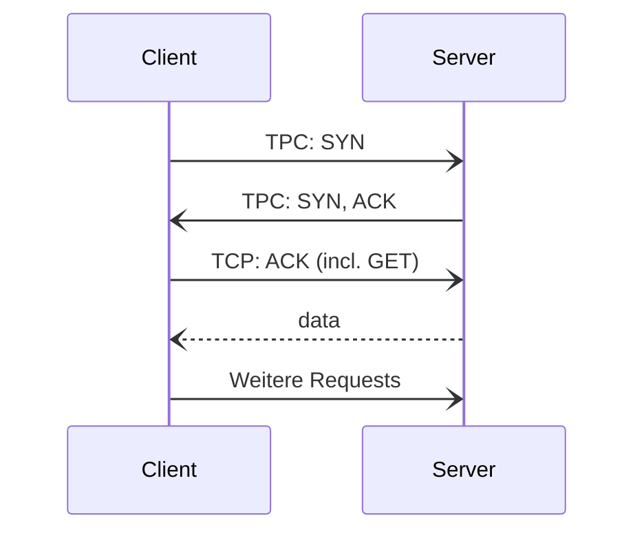

Transmission Control Protocol

- Verbindungsorientiertes Protokoll
- Wesentlicher Unterschied zu [[UDP]]: Alle Daten die Übertragen werden werden bestätigt.
- Für Jedes übertragene Segment gibt es eine Quittung

Bei TCP wird immer

- Quell-IP-Adresse
- Quell-Port
- Ziel-IP-Adresse
- Ziel-Port

übermittelt. Daraus lässt sich eine eindeutige Verbindung identifizieren.

#### Verbindungsablauf
1. 3-Wege-Handshake zum Verbindungsaufbau (inkl. erste Anfrage in letzter ACK-Message)
2. Zuverlässige Übertragung ist nun möglich
3. HTTP-Requests können übertragen werden (GET, POST, etc)
4. 4-Wege-Verbindungsabbau

#todo TCP-Verbindungsablauf aus Vorlesung übertragen

#### Aufgaben von TCP bei Übermittlung von Segmenten
- Abstimmung maximale Länge von Segmenten
- Grantie der Korrekten Reihenfolge der Segmente
- Wiederherstellung von Daten im Zielrechner durch die zusammensetzung der empfangenen Segmente
- Anforderung von verlorengegangenen Datensegmenten

#### Byteweise Nummerierung von Daten
- Zufällige Anfangs-Sequenznummer
- Sequenznummer += Gesendete Bytes

#### TCP-Header
- Quell- und Zielport
- Sequenznummer und ACK-Nummer (beide 32 Bit)
- Flags:
	- ACK => Acknowledge
	- RST  => Wird von Firewall geschickt, RESET kommt als Block-Nachricht
	- SYN => Verbindungsaufbau
	- FIN => Verbindungsabbau
- Window