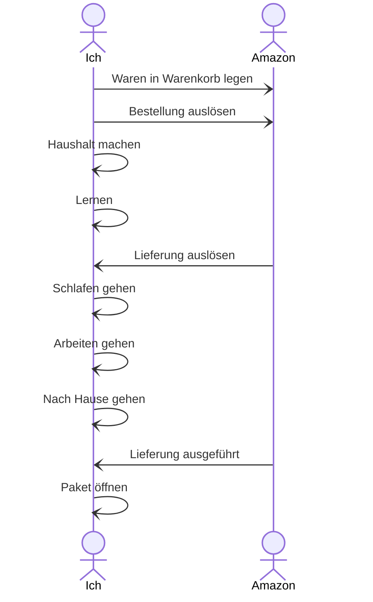
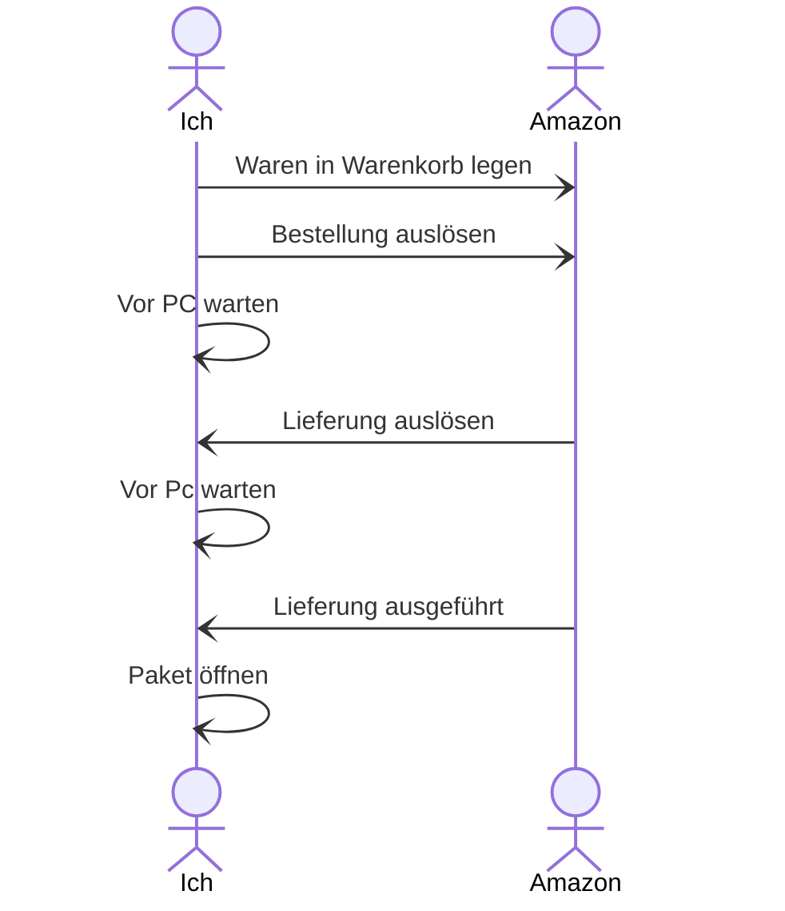

Asynchrone Kommunikation zwischen Client und Server kann zum Nachladen von Inhalten genutzt werden ohne das der Benutzer eine Interaktion ausführen muss.

### Asynchrone Requests
- Ein Programm kann Informationen von einer anderen Software anfordern und während des Wartens auf eine Antwort andere Dinge tun. 
- Beispiel: E-Mail

### Synchrone Requests
- Beziehen sich auf Echtzeitkommunikation, bei der jede Nachricht sofort empfangen und ggf. verarbeitet und beantwortet wird.
- Beispiel: Telefon

![[Pasted image 20230723163458.png]]

### Beispiel

##### ASYNC:

##### SYNC:

