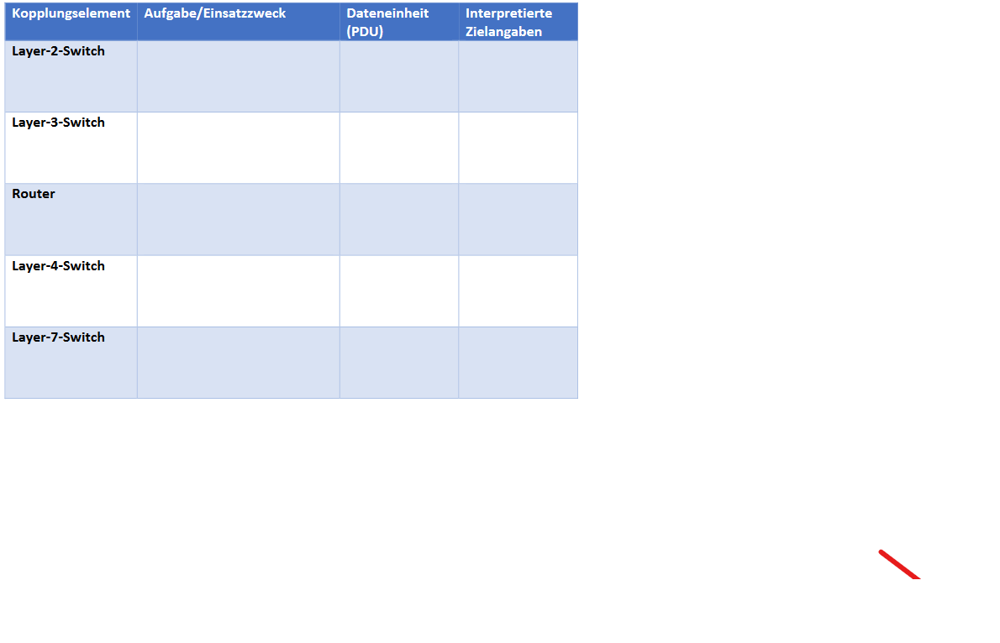
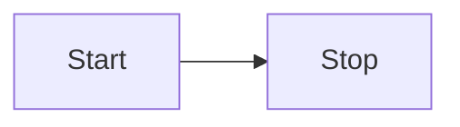

---
dg-publish: true
---

- I can create a link so by adding  \[\[\]\] around a word. When clicking on it, it will automatically create a new page.

I like this since its from [[05.04.2023]] 




### [[Obsidian Links |Links]] 
- Literature Note
- Reference a Concept
- Quote - Things
- We can add a # at the End of a Link to add some heading after it (visual only)
- We can add a ! before the beginning of a Link to show the actual text within
	- We can add a ^ before the end of the Link to show a specific paragraph
	- We can add a # before the end of the Link to show a specific heading including its contents

## Hashtag:

#WhatAHashtagIs We can explain what a hashtag is with this.
If we search for the hashtag we find every document and part where its used.
Its just as we would expect it to work.
We can organize them by using / for example #WhatAHashtagIs/HowToOrganize :). We can see all the Hashtags in a organized way right here:

![[Pasted image 20230406191615.png]]

## Links VS Hashtags
### When to use [[Obsidian Links]]?
- A Chapter of Knowledge
- Topics, Conecpts, Research Articles
- Example: "Mister Beast", "AI", "Obsidian Links", "Coding in C#"

### When to use #[[Obsidian Hashtags]]?
- Its for searching and finding mostly
- Categorize notes and contents
- Categories "with intent"
- Example: "#toNote", "#ToDo", "#c#", "#mathe2", "#prog/c#", "#uni/prog1"
- Think about yourself searching this in the future. Use with brain. 


id1[(Database)]

## Zettelkasen
- Fleeting Note = Daily Note
	- Raw Ideas, not distilled -> "daily Notes"
- Literature Note
	- For articles, books, research
	- Collection
	- Usually pretty big
	- Should ideally be written in own words
- Permanent Note / "Distilled Note"
	- The most distilles note
	- A single idea in just a few sentences ideally
	- Extreme consice; the kind of note you wanna memorise
	- Summarization of Literature / Topic Notes

![[Pasted image 20230406194559.png]]

## Alternative Zettelkasten
- Practical Notes:
	- Notizen über Meetings, Sachverhalte, Termine etc. die nicht in Daily Notes landen sollen.


## Suchen mit Obisidan
-  Hotkey: Ctrl + Shift + F
- Kann wörter wie "OR" nutzen
- Beispiel:
	- "Parry OR Alli"
	- "Parry -alli" (ohne alli)
- Begriffe aus der Suche können einfach rausgezogen werden um einen Link zu erstellen
- Path: => Sucht nach Dateiname
- Quick Switcher: Ctrl+ O
- Kann Regex
- Wenn man etwas immer suchen will kann man ```query``` nutzen.


## Formatting

### Quotes

>"Here is some quote"
>- Peter(2023)


### Code

-  Wie in Discord :)
```c#
Console.WriteLine("Hello :)");
```


### More

- [ ] CheckBox
- [ ] CheckBoxChecked
\- \[ \] CheckBox

## Tables

Pros | Cons
-------------  |  --------------
Feeling Good  | Feeling Bad
Good for Heart | Not so good for ~~heart~~

## Callouts

note: 
>[!note] Note: Remember to save your work frequently 
>\>[!note] Autosave is enabled every 5 minutes

abstract: 
>[!abstract] Abstract: This study explores the effects of climate change on agriculture 
>\>[!abstract] Results show a significant decrease in crop yields


summary: 
>[!summary] Summary: Our new software release includes bug fixes and performance improvements 
>\>[!summary] Update now to experience a smoother user interface

tldr: 
>[!tldr] TLDR: The article explains the benefits of a healthy diet and exercise for a longer life 
>\>[!tldr] Eat well and stay active to improve your overall health

info: 
>[!info] Info: The conference will be held online due to COVID-19 restrictions 
>\>[!info] Access the event through the provided link

todo: 
>[!todo] Todo: Finish the presentation slides before the meeting 
>\>[!todo] Add graphics and data to support your points

tip: 
>[!tip] Tip: Use keyboard shortcuts to save time while editing documents 
>\>[!tip] Ctrl+C to copy, Ctrl+V to paste, Ctrl+Z to undo

hint: 
>[!hint] Hint: To find the solution, use the Pythagorean theorem 
>\>[!hint] a² + b² = c²

important: 
>[!important] Important: Backup your data regularly to avoid data loss 
>\>[!important] Schedule automatic backups for added security

success: 
>[!success] Success: Your payment has been processed 
>\>[!success] Receipt will be emailed to your registered address

check: 
>[!check] Check: Verify your email address to complete registration 
>\>[!check] Click the link in the confirmation email

done: 
>[!done] Done: Task completed successfully 
>\>[!done] Marked as complete in the project management tool

question: 
>[!question] Question: How does photosynthesis work in plants? 
>\>[!question] Light energy is used to convert water and carbon dioxide into glucose and oxygen

help: 
>[!help] Help: Can't find the import option in the software? 
>\>[!help] Navigate to File > Import to access the feature

faq: 
>[!faq] FAQ: What is the return policy for online purchases? 
>\>[!faq] Items can be returned within 30 days of delivery for a full refund

warning: 
>[!warning] Warning: Do not expose electronic devices to water 
>\>[!warning] Water damage may cause permanent malfunction

caution: 
>[!caution] Caution: Hot surface, handle with care 
>\>[!caution] Allow to cool before touching

attention: 
>[!attention] Attention: Unexpected server downtime may affect your work 
>\>[!attention] Save your progress and check for updates

failure: 
>[!failure] Failure: The system was unable to complete the requested action 
>\>[!failure] Contact support for assistance

fail: 
>[!fail] Fail: The password provided is incorrect 
>\>[!fail] Please try again or reset your password

danger: 
>[!danger] Danger: Hazardous materials stored in this area 
>\>[!danger] Follow safety protocols and wear protective gear

error: 
>[!error] Error: The application encountered an error and needs to close 
>\>[!error] Restart the application and contact support if the issue persists

bug: 
>[!bug] Bug: The software displays incorrect data 
>\>[!bug] Developers have been notified and are working on a fix

example: 
>[!example] Example: Calculate the area of a rectangle 
>\>[!example] Area = Length x Width

quote: 
>[!quote] Quote: "The only way to do great work is to love what you do." - Steve Jobs 
>\>[!quote] Passion and determination are key to success


## Footnotes
For example this is some not so big footnote[^1]

[^1]: yes yes some real footnote!

sadasd


## Maths
- Use Mathjax + Latex
$$
\frac{a}{b} = c +d
$$


## Diagrams 
- Use Mermaid here -> watch youtube video later




## Embed HTML Stuff

- Just Paste IFrames here:
<iframe width="560" height="315" src="https://www.youtube.com/embed/WqKluXIra70" title="YouTube video player" frameborder="0" allow="accelerometer; autoplay; clipboard-write; encrypted-media; gyroscope; picture-in-picture; web-share" allowfullscreen></iframe>


## Database
- Create a Database with dataview
- Works with [[Obsidian Hashtags]].
```dataview
TABLE 
	source as "Source",
	rating as "Score",
	time as "Time"
FROM #testdb 
```

## Templates
- Öffnen Kommando-Palette mit Ctrl+P  ->  Template
- #todo ein eigenes Template für Practical, Distilled und Literature Notes anlegen.
- Vielleicht auch Daily Note ein standard-template anlegen.


## PDFs

[[impact ai on innovation.pdf]]
[[impact ai on innovation.pdf#page=3]]


- Auch noch mit ! davor aber das geht jetzt gerade irgendwie nicht #todo